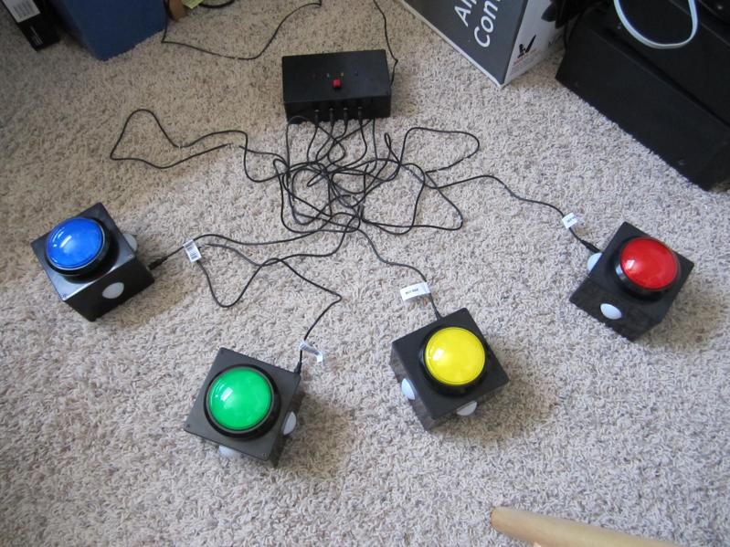

**Buzzers**
-------

This project is a set of quiz show style buzzers.  The brains of the operation is an Arduino, which is attached to 4 button boxes equipped with a large button and a series of colored LEDs.  The main control box houses the arduino and 4 indicator LEDs that display the order in which the buzzers are pressed.  For more on the construction of the buzzers, see this [blog post](http://sharpk60.blogspot.com/2014/12/quiz-show-buzzers.html).

### **Setup**

Plug each button box in to the corresponding port on the control box.  The blue button box should connect to the port below the blue LED on the control box, the red box shoulc connect below the red LED, etc. until all 4 button boxes connected.

### **Usage**

When a player presses their button the corresponding LED on the control box will light up and possibly flash showing in what order the players buzzed in, as follows
* 1st player to buzz in will have a solid-lighted LED on the control box and the LEDs on their box will flash.
* 2nd player will have a fast blinking LED
* 3rd player will have a slow blinking LED
* 4th player's LED will be off

To reset after the players have buzzed in, press the red button on the control box.
